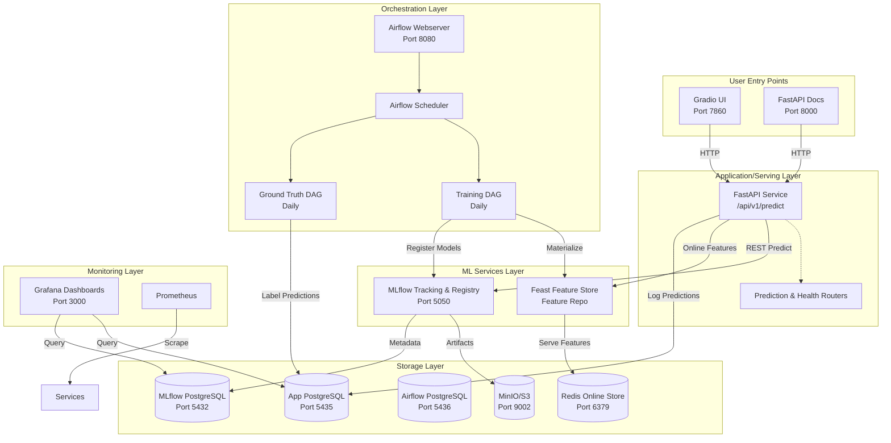
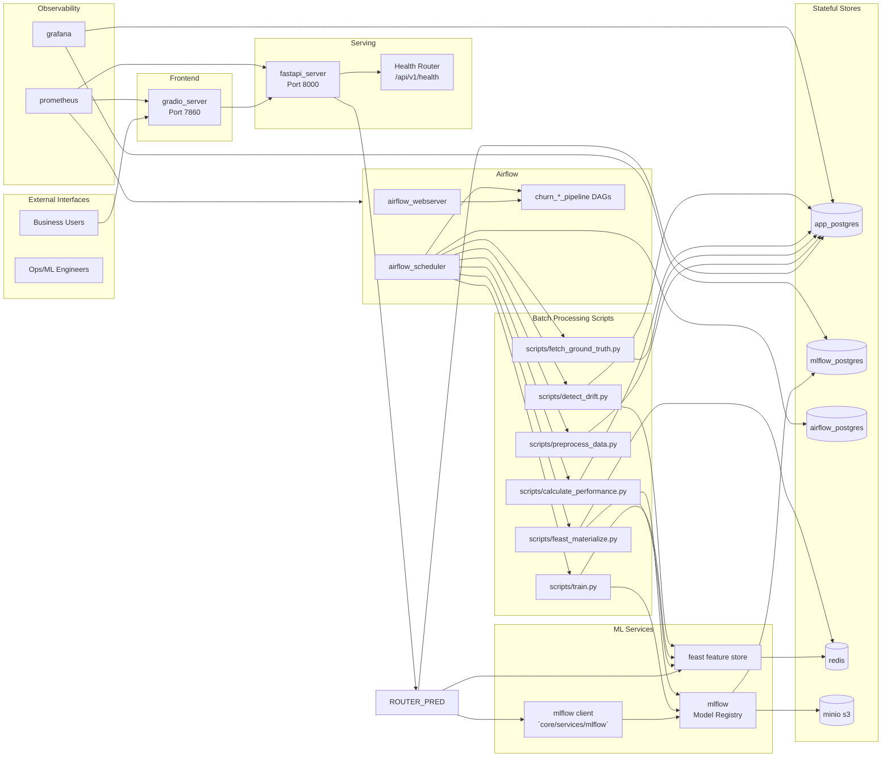
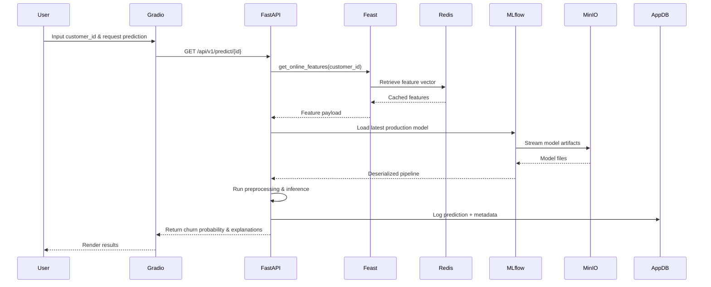
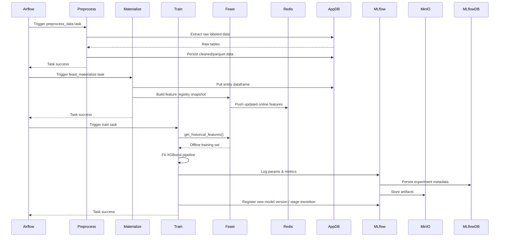
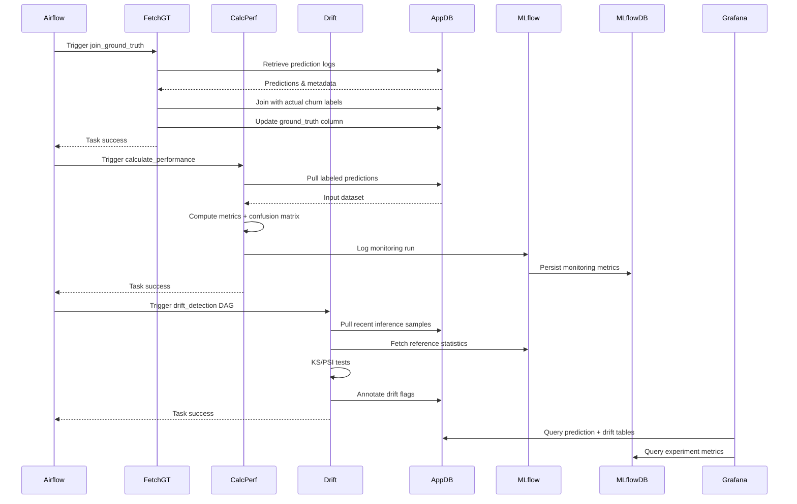
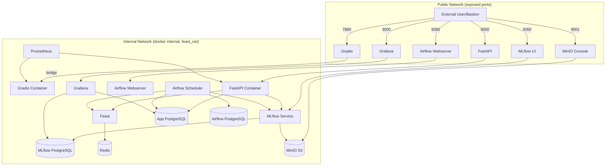
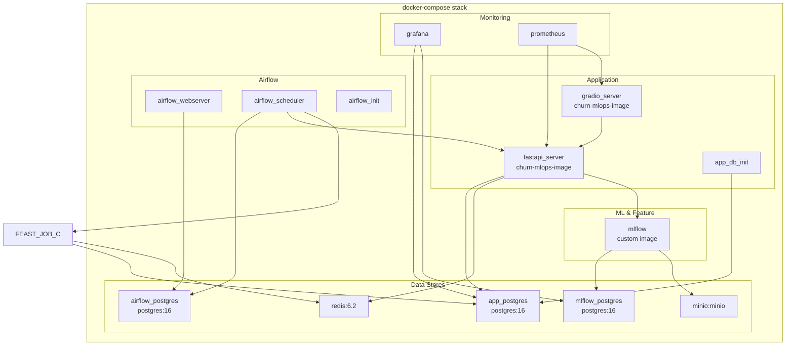

# Customer Churn MLOps Architecture

This document captures the core architecture viewpoints for the Customer Churn prediction platform. It mirrors the structure of `ARCHITECTURE.md` while adding fully annotated diagrams and textual callouts for each view.

## High-Level Architecture

**Key notes**
- Serving tier keeps an in-memory model handle loaded from MLflow on startup to reduce latency.
- Feast’s feature view definitions live in `feature_repo/definitions.py` with Redis as online store.
- Airflow orchestrates both model lifecycle and monitoring DAGs, sourcing data from PostgreSQL.

## Detailed Component Architecture

**Highlights**
- Scripts are containerized and triggered as Airflow tasks, sharing the same Docker image as FastAPI for dependency consistency.
- Redis serves both Feast online features and inference caching.
- Prometheus metrics feed Grafana dashboards for service SLOs.

## Data Flow Architecture

### Prediction Flow

### Training Pipeline Flow

### Ground Truth & Monitoring Flow

## Network Architecture

**Security considerations**
- Internal services communicate on the Docker `internal` network; no direct exposure.
- Access to MLflow UI and Airflow UI is gated through authenticated ingress/Bastion.
- MinIO console (9001) requires access key/secret key supplied via environment variables.

## Container Architecture

**Runtime notes**
- Shared Docker image for FastAPI/Gradio ensures consistent Python environment.
- PostgreSQL and MinIO containers mount named volumes for durability; backup procedures snapshot these volumes nightly.
- Airflow containers mount `dags/` and `logs/` volumes for hot-reloads and task visibility.

