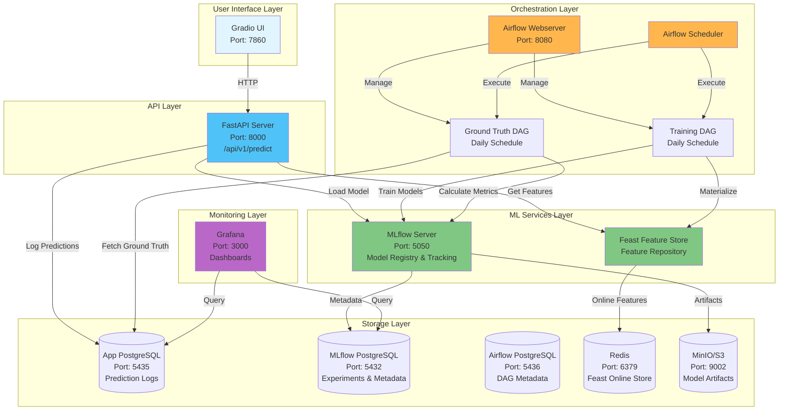
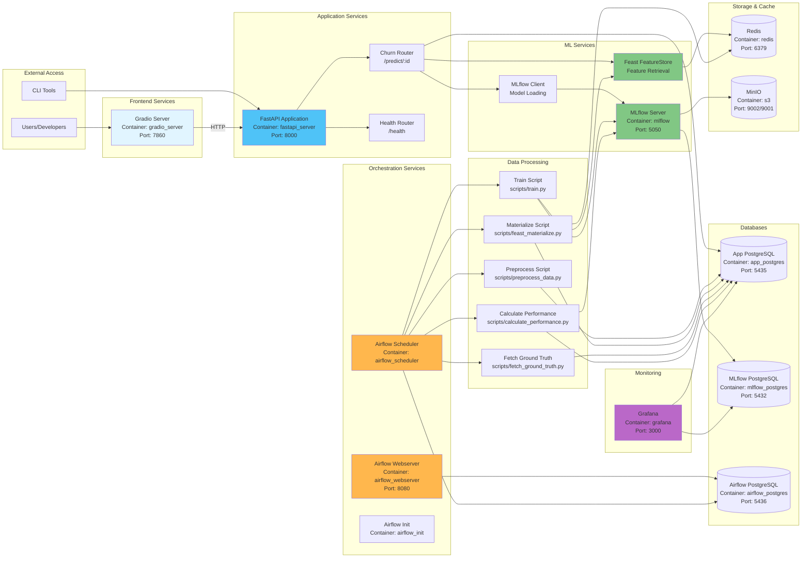
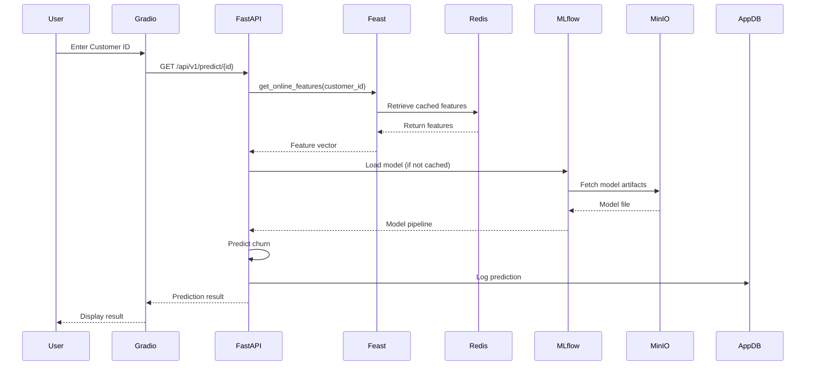
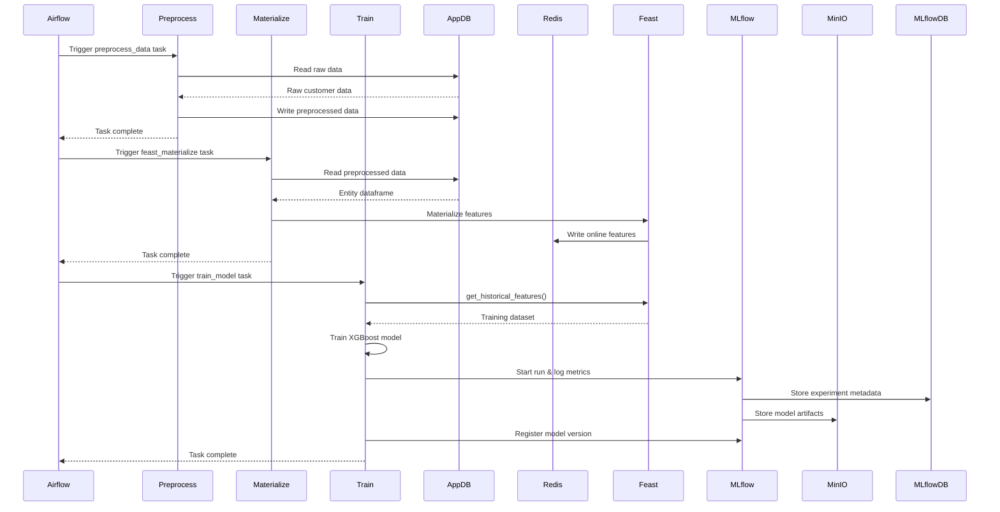
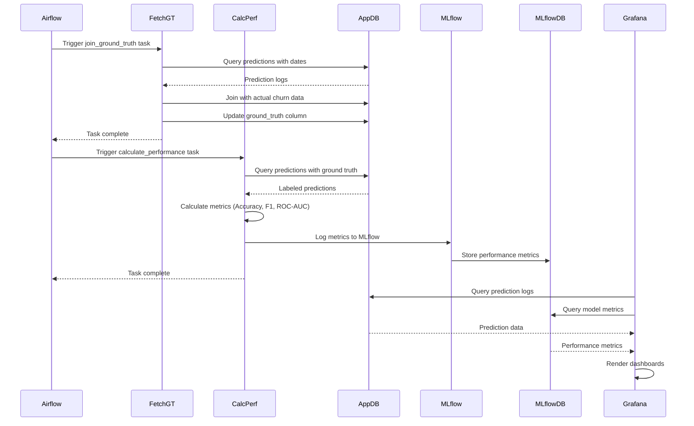
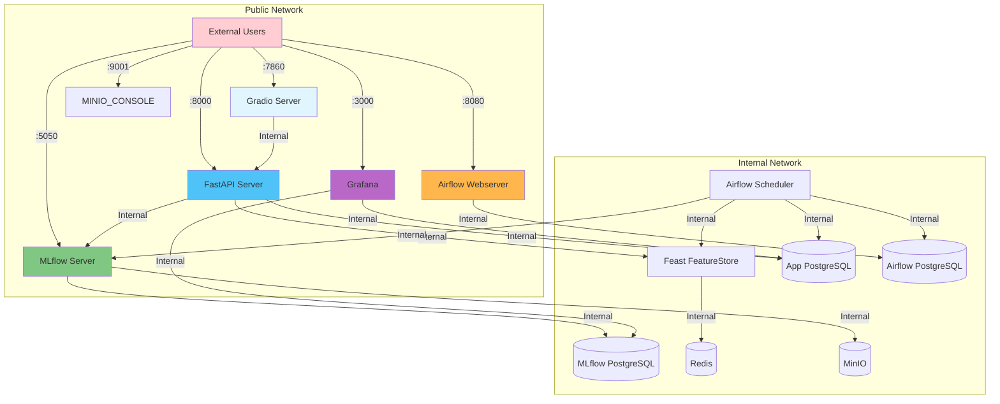
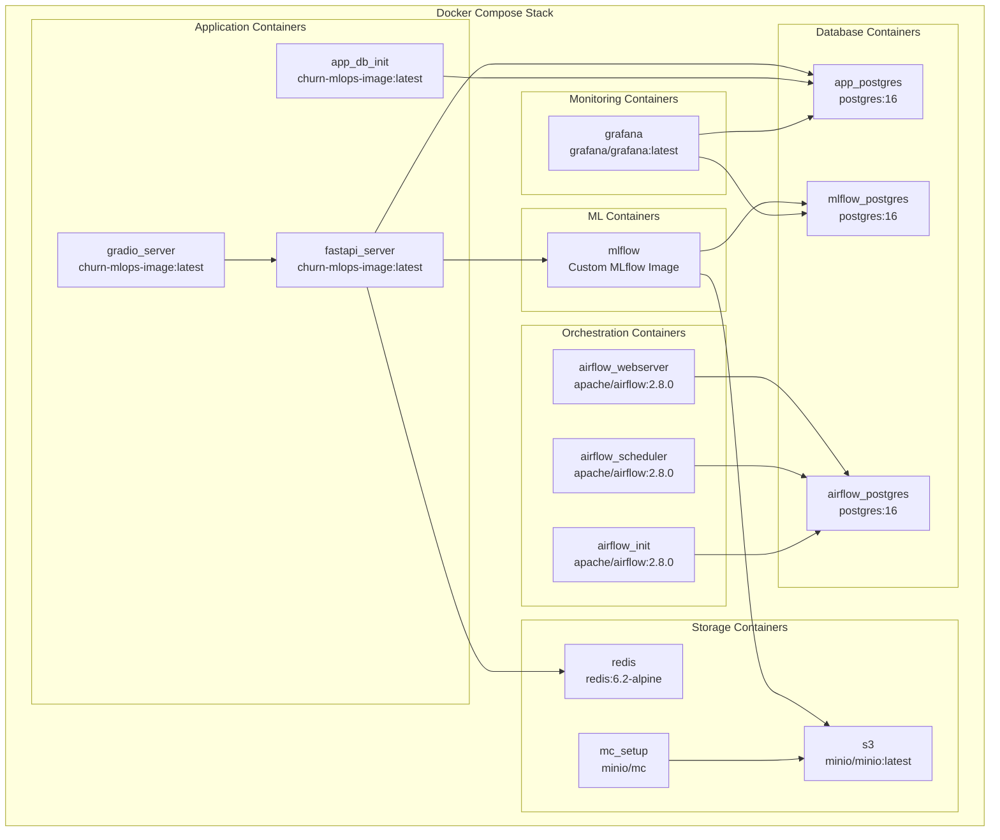

# Software Architecture Diagram

## System Architecture Overview

This document provides a comprehensive view of the Customer Churn MLOps platform architecture, including all components, data flows, and interactions.

## High-Level Architecture

## Detailed Component Architecture

## Data Flow Architecture

### Prediction Flow

### Training Pipeline Flow

### Ground Truth & Monitoring Flow

## Network Architecture

## Container Architecture

## Component Details

### FastAPI Application
- **Container**: `fastapi_server`
- **Port**: 8000
- **Endpoints**:
  - `GET /api/v1/predict/{customer_id}` - Churn prediction
  - `GET /api/v1/health` - Health check
- **Dependencies**: MLflow (model loading), Feast (feature retrieval), PostgreSQL (prediction logging)
- **Lifespan**: Loads model and Feast store on startup

### MLflow Server
- **Container**: `mlflow`
- **Port**: 5050
- **Backend Store**: PostgreSQL (experiments, runs, metadata)
- **Artifact Store**: MinIO S3 (model files, artifacts)
- **Functions**: Model registry, experiment tracking, model versioning

### Feast Feature Store
- **Repository**: `feature_repo/`
- **Online Store**: Redis (real-time feature serving)
- **Offline Store**: PostgreSQL (historical features)
- **Features**: Customer demographics, transaction history, interaction metrics

### Airflow Orchestration
- **Webserver**: Port 8080 (UI)
- **Scheduler**: Executes DAGs
- **DAGs**:
  1. `churn_model_training_pipeline` - Daily training
  2. `churn_ground_truth_pipeline` - Daily monitoring

### Databases
- **App PostgreSQL** (Port 5435): Prediction logs, customer data, ground truth
- **MLflow PostgreSQL** (Port 5432): Experiment metadata, run history
- **Airflow PostgreSQL** (Port 5436): DAG metadata, task history

### Storage
- **Redis** (Port 6379): Feast online feature cache
- **MinIO** (Port 9002/9001): S3-compatible object storage for MLflow artifacts

### Monitoring
- **Grafana** (Port 3000): Dashboards for model performance and system metrics
- **Data Sources**: App PostgreSQL, MLflow PostgreSQL

## Technology Stack Summary

| Layer            | Technology             | Purpose                        |
| ---------------- | ---------------------- | ------------------------------ |
| Frontend         | Gradio                 | Interactive UI for predictions |
| API              | FastAPI                | REST API for model serving     |
| ML Framework     | XGBoost, scikit-learn  | Model training and inference   |
| Feature Store    | Feast                  | Feature management and serving |
| Model Registry   | MLflow                 | Model versioning and tracking  |
| Orchestration    | Apache Airflow         | Workflow automation            |
| Databases        | PostgreSQL             | Data persistence               |
| Cache            | Redis                  | Feature caching                |
| Storage          | MinIO                  | Model artifact storage         |
| Monitoring       | Grafana                | Metrics and dashboards         |
| Containerization | Docker, Docker Compose | Deployment and orchestration   |

## Deployment Architecture

All services are containerized and orchestrated via Docker Compose:
- **Networks**: `internal`, `public`, `feast_net`
- **Volumes**: Persistent storage for databases and MinIO
- **Health Checks**: All services include health check configurations
- **Dependencies**: Services start in correct order based on dependencies

